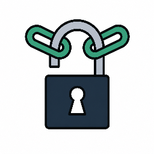

  

# DropLock

Most (maybe all) [existing sharing tools][1] require the sender to either
send the decryption key in the URL or out of band.

The nicest UX is sending the key in the URL fragment, but this means anyone
with the link can decrypt the data, and it might end up in browser history,
email scanner logs, etc. This is generally mitigated by making messages
one-time-use, or expiring after a period of time, but such mitigations preclude
sending the encrypted data in the same channel as the link, or even in the link
itself. You also require a server.

This app is different. It lets the sender send encrypted data over any channel,
secure or not, without worrying about where the link ends up, because only
the receiver can decrypt it.

1. Receiver opens the app which generates a key pair with a non-extractable
   private key. A link including the public key is generated.
2. Receiver sends link to sender.
3. Sender opens link and enters text.
4. Sender encrypts the message and gets a return link with `#m=<message>`.
5. Sender sends the return link to receiver.
6. Receiver opens link and reads the secret.

Message format: see `FORMAT.md`.

Generating a new key changes the request link. Old messages for that browser
key can no longer be decrypted.

[1]: https://gist.github.com/SMUsamaShah/fd6e275e44009b72f64d0570256bb3b2
